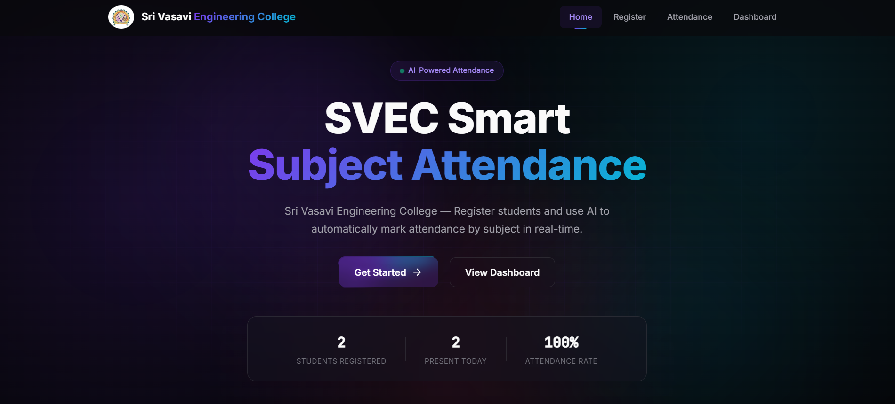
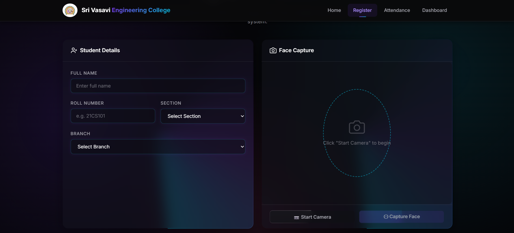
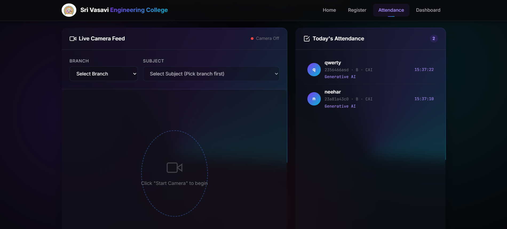
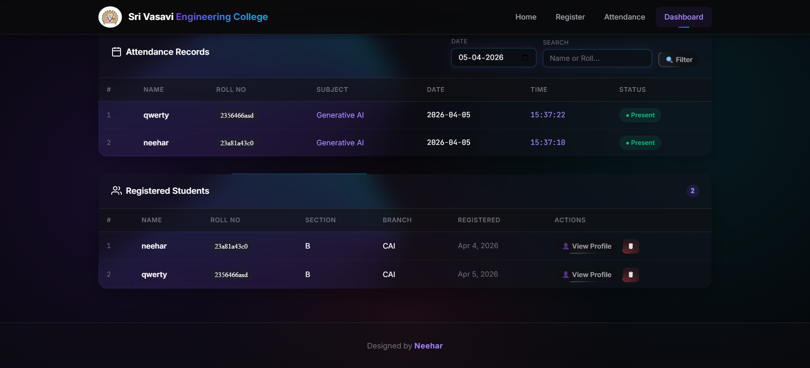

# Smart AI Face Attendance System

A full-stack Smart Face Recognition Attendance System built with Python (Flask), OpenCV, the `face_recognition` library, and MongoDB. This system captures face data, securely recognizes students in real-time, and provides an administrative interface for managing daily, subject-wise attendance.

## Features
- **Real-Time Face Recognition:** Automatically detects and verifies registered faces via webcam.
- **Attendance Tracking:** Allows subject-wise attendance marking for various engineering branches.
- **Admin Dashboard:** Access student profiles, review subject-specific attendance records, and manage the system.
- **Student Enrollment:** Easy onboarding flow to capture and store face encodings securely.
- **MongoDB Integration:** Efficient NoSQL storage for student data and attendance logs.

## Screenshots

### Main Dashboard / Home


### Student Enrollment


### Real-time Recognition


### Attendance Reports & Records


## Technologies Used
- **Backend:** Python, Flask
- **Database:** MongoDB
- **Computer Vision:** OpenCV (`opencv-python`)
- **Face Recognition:** `face_recognition` (dlib)
- **Image Processing:** Numpy, Pillow
- **Frontend:** HTML, CSS, JavaScript (via Flask templates)

## Prerequisites
- Python 3.8+
- MongoDB installed and running locally, or access to a MongoDB Atlas cluster (configure settings in `config.py`)
- C++ Build Tools (required for installing the `dlib` dependency used by `face_recognition`)

## Installation and Setup

1. **Clone the repository (or navigate to the project folder):**
   ```bash
   cd e:\attendence_system
   ```

2. **Create a virtual environment (optional but recommended):**
   ```bash
   python -m venv .venv
   ```
   *Activate it:*
   - On Windows: `.venv\Scripts\activate`
   - On macOS/Linux: `source .venv/bin/activate`

3. **Install the dependencies:**
   ```bash
   pip install -r requirements.txt
   ```

4. **Verify MongoDB Connection:**
   Ensure your local MongoDB server is running. You can verify or edit your connection string in `config.py`. 

5. **Run the Application:**
   ```bash
   python app.py
   ```

6. **Access the System:**
   Open your browser and navigate to `http://localhost:5000` (or whichever port the Flask app exposes).

## Project Structure
- `app.py`: Main entry point for the Flask application.
- `requirements.txt`: Python package dependencies.
- `config.py`: Configuration settings (e.g., Database URI).
- `models/`: Database schemas and data interaction logic.
- `services/`: Core logic for face recognition and camera interactions.
- `templates/`: HTML files for the web interface.
- `static/`: CSS, JS, and image assets for the frontend.
- `captured_faces/`: Temporary storage for images taken during user enrollment/recognition.
- `mongodb_data/`: Local database storage directory.

## License
MIT License
